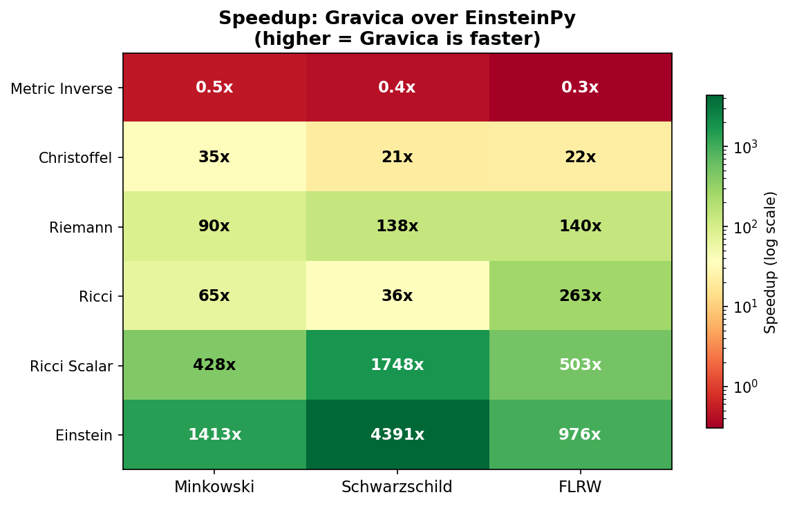
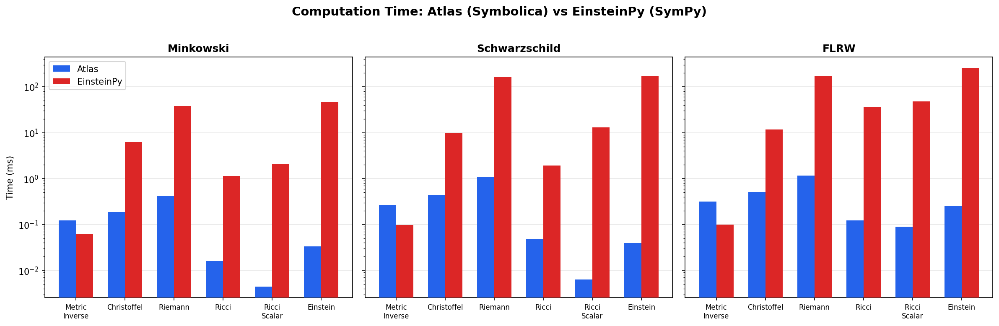

# Gravica

General Relativity computation library built on [Symbolica](https://symbolica.io/) (Rust-powered CAS).

Gravica computes the full GR tensor chain — from metric tensor to Einstein tensor — using Symbolica's high-performance symbolic algebra engine, achieving **23x–4300x speedup** over EinsteinPy/SymPy.

## Features

- Full GR computation chain: Metric → Christoffel → Riemann → Ricci → Einstein → Weyl
- Built-in metrics: Minkowski, Schwarzschild, Kerr, FLRW
- Lazy evaluation with caching
- Cross-validated against EinsteinPy

## Documentation

API reference: [https://site.jijinbei.jp/gravica/](https://site.jijinbei.jp/gravica/)

## Quick Start

```bash
uv add gravica
```

```python
from gravica.metrics.schwarzschild import schwarzschild
from gravica.christoffel import ChristoffelSymbols
from gravica.riemann import RiemannTensor
from gravica.ricci import RicciTensor, ricci_scalar
from gravica.einstein import EinsteinTensor

metric = schwarzschild()
christoffel = ChristoffelSymbols(metric)
riemann = RiemannTensor(christoffel)
ricci = RicciTensor(riemann)
einstein = EinsteinTensor(ricci)

# Verify vacuum solution: G_{ab} = 0
for a in range(4):
    for b in range(4):
        assert str(einstein[a, b]) == "0"
```

## Benchmarks: Gravica vs EinsteinPy

All benchmarks measured on the same machine. Median of 3 runs with GC disabled.

### Speedup Heatmap



### Absolute Time Comparison



### Summary

| Computation | Minkowski | Schwarzschild | FLRW |
|---|---|---|---|
| Christoffel | **33x** | **23x** | **23x** |
| Riemann | **91x** | **149x** | **147x** |
| Ricci | **72x** | **40x** | **296x** |
| Ricci Scalar | **472x** | **2021x** | **544x** |
| Einstein | **1391x** | **4342x** | **1029x** |

> Metric inverse is ~0.3–0.5x (Python cofactor overhead), but this is amortized by the massive speedups in downstream computations.

### Reproduce

```bash
uv run benchmarks/run_benchmarks.py    # Run benchmarks
uv run benchmarks/plot_benchmarks.py   # Generate charts
```

## Architecture

```
MetricTensor → ChristoffelSymbols → RiemannTensor → RicciTensor → EinsteinTensor
                                                                 → WeylTensor
```

| Module | Computes |
|---|---|
| `metric.py` | g_{ab}, g^{ab}, det(g) |
| `christoffel.py` | Γ^a_{bc} = g^{ad} ½(∂_b g_{ac} + ∂_c g_{ab} - ∂_a g_{bc}) |
| `riemann.py` | R^a_{bcd} = ∂_c Γ^a_{db} - ∂_d Γ^a_{cb} + Γ^a_{ce}Γ^e_{db} - Γ^a_{de}Γ^e_{cb} |
| `ricci.py` | R_{ab} = R^c_{acb}, R = g^{ab} R_{ab} |
| `einstein.py` | G_{ab} = R_{ab} - ½ g_{ab} R |
| `weyl.py` | C_{abcd} (Weyl conformal tensor) |

## Tests

```bash
uv run pytest tests/ -v
```

Verified properties:
- **Minkowski**: All tensors = 0
- **Schwarzschild**: R_{ab} = 0, G_{ab} = 0 (vacuum solution)
- **Riemann symmetries**: R^a_{bcd} = -R^a_{bdc}
- **Christoffel known values**: Γ^r_{tt} = r_s(r-r_s)/(2r³)
- **EinsteinPy cross-validation**: Christoffel and Ricci match

## License

MIT
